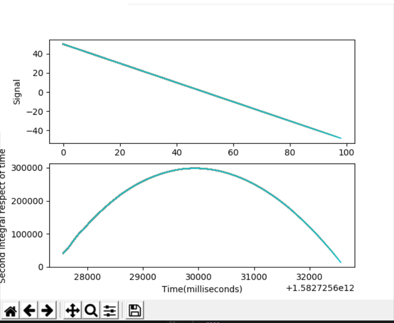
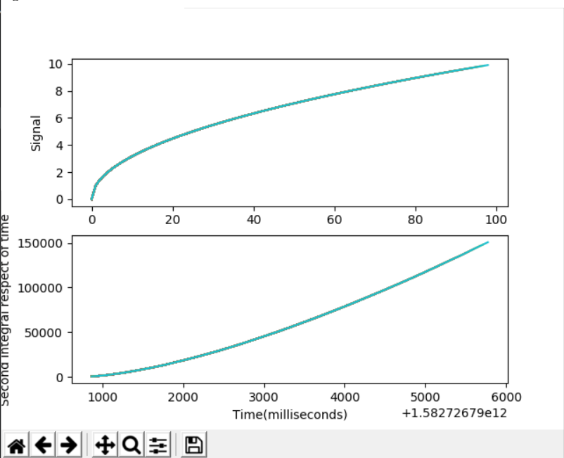
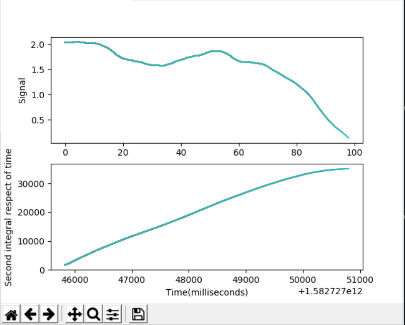
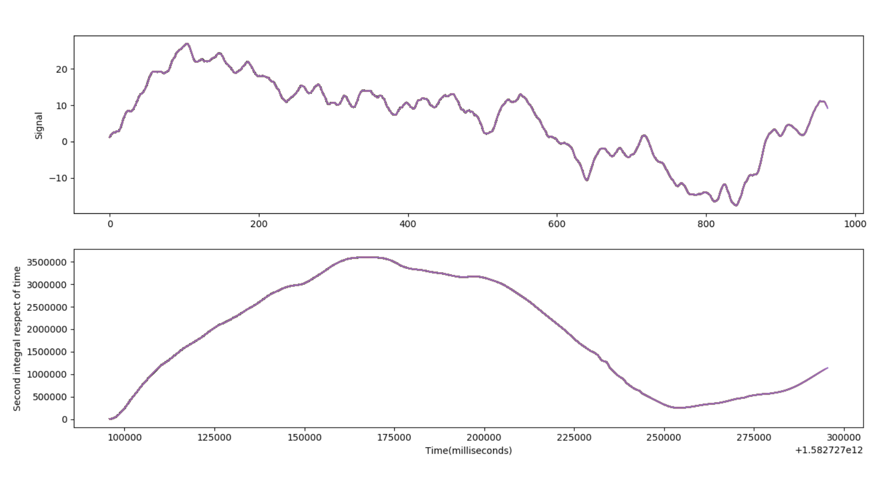

# Sensor-Integral
Get the area under the curve of the graph of a constant stream of recived values. These values could be recived, for example from a sensor like an IMU or an accelerometer to obtain an approximation of the distance travelled, integrating two times the acceleration.

# Captures

